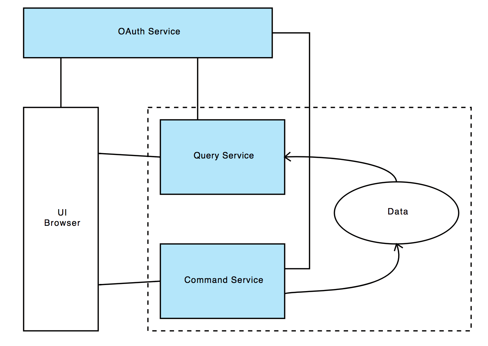

= Spring Playground

This is my private Playground for some _on hands_ programming with Reactiv, Spring and Kotlin (and perhaps some other things I want to try).

== Overview
As first idea I create a _Blog Service_ which contains three main components:

- Query Service
- Commands Blog Service
- Database

Those represents the _Blog Service_.
For some testing I also want to have an _Authentication Service (IDP)_ which provides something similar to an OAuth service.

.Overview

== Components
The Playground is separated in several components (aka subproject / directories).
Some of them already exist and some not.

=== Blog Service (Query)
Provides the read (Query) part of the service. +
Will be realized with _Spring_ and _Spring Reactor_.

=== Blog Service (Commands)
Provides the write (Command) part of the service. +
Will be realized with _Spring_ and _Spring WebMVC_.

=== Blog Database
Provides (starts) just the database. +
The database will be a link:https://www.mongodb.com/[MongoDB].

=== Identity Provider Service
Provides some identity serivce (e.g. IDM/IDP, OAuth2??) +
Will be realized with _Spring_ and _Kotlin_.

== Runtime
To run these services link:https://www.docker.com/[Docker] (see https://hub.docker.com/u/mibo[mibo@DockerHub]).